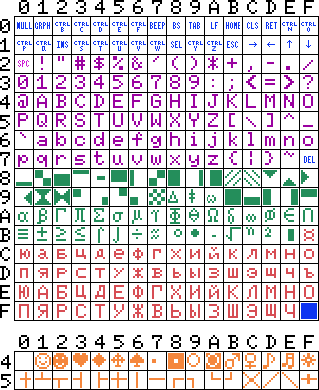

# Конвертер текстов созданных на MSX в кодировку UTF-8
Таблица символов MSX:

   16   |    10   | Описание 
--------| ------- | ---------------------------------------------------------------------------------
00h-7Fh | 0-127   | первые 128 символов соответствуют международной раскладке
80h-BEh | 128-190 | символы, которые в международной таблице находятся в диапазоне C0h-FEh (192-254)
BFh-FEh | 191-254 | русские символы
FFh     | 255     | курсор
40h-5Fh | 64-95   | графические символы, для обращение к ним используется префикс 01h (01)

Русский набор символов в основном соответствует KOI8-R, за исключением того, что на MSX отсутствуют буквы «Ъ», «Ё» и «ё». 

Для подбора UTF символов использовался сайт https://unicode-table.com/ru/ проекта 

Пока не подобраны замены для символов с кодами:

 16    |   10 
------ | ------
5Fh    | 95
85h    | 133
88h    | 136
0148h  | 01 72
0150h  | 01 80

Проект был создан для работы над файлами книги 

## Основных программы
**msx_russian-utf8.py** скрипт для конвертирования одного файла

**msx2file.bas** программа для вывода таблицы кодов символов в файл test.msx

**test.msx** файл созданный программой msx2file.bas

**test.txt** результат работы скрипта msx_russian-utf8.py с файлом test.msx

### msx_russian-utf8.py
Для написания скрипта использовался Python 2.7

Скрипт производит побайтовое чтение исходного файла (в кодировке MSX), в зависимости от значения байта выполняется его замена (конвертирование) и сохранение в специальную переменную. После достижения конца исходного файла сконвертированная последовательность байт сохраняется из переменной в конечный файл.

Пример: ./msx_russian-utf8.py test.msx test.txt

### msx_russian-utf8-batch_mode.sh
Скрипт для конвертирования нескольких файлов.

Для его работы нужно задать переменные:

` files_path='.' `путь к исходным и конечным файлам

` file_ext_msx='.msx' `расширение исходного файла (MSX)

` file_msx_mask='test' `	маска исходных файлов, без расширения (MSX)

` file_ext_utf='.txt'	` расширение конечного файла (UTF-8)

## Дополнительные программы

**msx2scrn.bas** вывод таблицы кодов символов на экран

**msxfont1.bas** вывод символов на экран шириной 16 символов

**msxfont2.bas** вывод символов на экран шириной 32 символа
